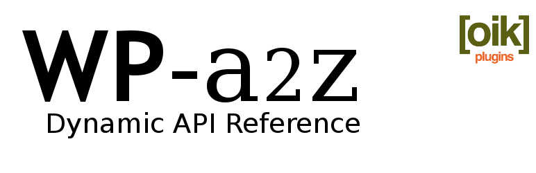

# oik-update 

* Contributors: bobbingwide, vsgloik
* Donate link: https://www.oik-plugins.com/oik/oik-donate/
* Tags: oik, plugin, update, WP-a2z, blocks, themes, APIs
* Requires at least: 5.8.1
* Tested up to: 5.9-beta3
* Stable tag: 1.0.0

oik-batch routines to semiautomate the process of updating

- the WP-a2z API reference for WordPress core, selected plugins and themes
- document blocks for the WordPress block editor - Gutenberg
- document Full Site Editing themes

## Description 
oik-update provides three batch routines which are invoked by oik-batch.

- oik-blocker.php to improve the generation of blocks for a plugin listed in blocks.wp-a2z.org
- oik-themer.php to improve the registration of FSE themes listed in blocks.wp-a2z.org
- oik-update.php to improve applying API updates for WordPress, plugins or themes

These are run from 3 command line routines, which use oik-batch run against --url=blocks.wp.a2z

- blocks.bat
- themes.bat
- update.bat

## Installation 
1. Install as if it were a WordPress plugin
1. Invoke using oik-batch

Dependent upon:

- oik-batch
- wp-top12
- Various plugins used in WP-a2z.

## Screenshots 

None

## Upgrade Notice 
# 1.0.0 
Upgrade for oik-themer.php and improvements to oik-blocker.php

## Changelog 
# 1.0.0 
* Added: Add logic to generate blocks from block.json files #2
* Added: Add oik-themer.php for FSE themes #4
* Changed: Add logic to set featured image, template and some Yoast SEO metadata #4
* Changed: Improve methods for setting the featured image #4
* Changed: Promote some methods to OIK_wp_a2z from OIK_blocker #4
* Tested: With WordPress 5.9-beta2 and beta3
* Tested: With PHP 8.0

Some previous versions were tagged the same as WordPress releases.
I'm not quite sure why I did this.
I've removed the tags but not changed the commit messages.

## Further reading 

If you want to read more about oik plugins and themes then please visit
[oik-plugins](https://www.oik-plugins.com/)
